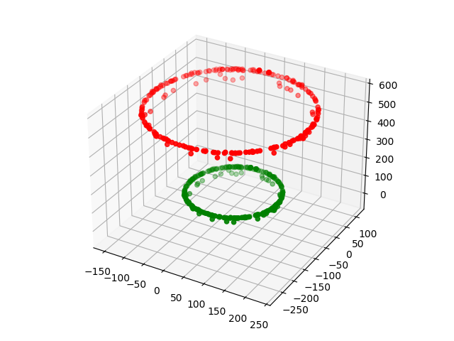
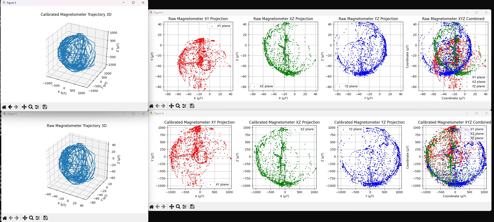

# Outputs

| Output | Where |
| --- | --- |
| C code block + JSON block | stdout, unchanged from the original tool (safe to keep parsing) |
| Calibration file | `<input>_calibration.json` with `--json` (schema v2: coefficients, target field, capture name, diagnostics) |
| Calibrated data | `<input>_calibrated.csv` / `<input>_calibrated.txt` with `--save` (default), `-o` to choose |
| Quality report | stdout with `--report text`, stdout as JSON with `--report json` |
| Plots | window with `--plot`, PNG files with `--plot-file` (a `_magnitude` figure shows the `|B|` distributions and the sphere coverage) |

Old v1 calibration files (without a `version` key) still load with `--apply`.

## Plots

`--plot` opens the before/after figures, `--plot-file out.png` writes them headlessly
(`out.png`, `out_magnitude.png`):

